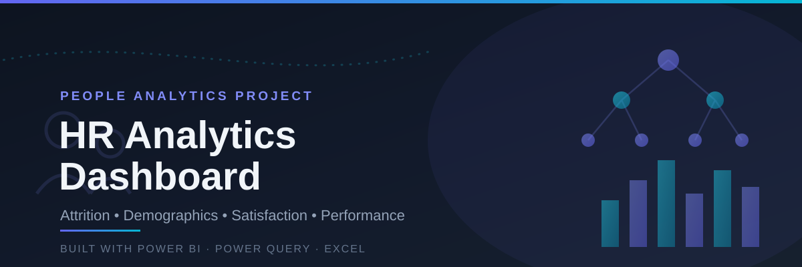
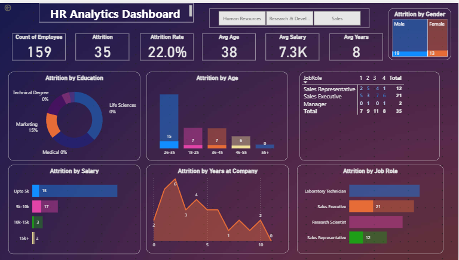

# 👨‍💼 HR Analytics Dashboard | Power BI

Analysis of **employee records** to understand attrition drivers, workforce demographics, job satisfaction and performance, and to support data-driven HR decisions.

---

## 📌 Project Overview

Employee attrition is costly for any organization, and HR teams often can't see where it is happening or why. This project turns raw employee data into an interactive Power BI dashboard to answer:

- Which departments and job roles have the highest attrition?
- Which age groups and employee segments are leaving the most?
- How do job satisfaction and work-life balance relate to attrition?
- Does compensation (monthly income, salary hike) play a role in employee exits?
- What does the workforce look like by gender, education and marital status?

The workflow covers the full analytics pipeline: **raw data → Power Query cleaning → data modeling → Power BI dashboard.**

---

## 🛠️ Tools & Technologies

| Stage                          | Tool        |
| ------------------------------ | ----------- |
| Data storage & cleaning        | Excel / CSV |
| Data transformation & modeling | Power Query |
| Dashboard & visualization      | Power BI    |

---

## 📂 Repository Contents

| File                                  | Description                                  |
| ------------------------------------- | -------------------------------------------- |
| `HR_Analytics.csv`                    | Raw employee dataset                         |
| `HR Analytics Dashboard.pbix`         | Power BI dashboard file                      |
| `HR Analytics data and dashboard.zip` | Packaged data + dashboard for offline use    |

---

## 📊 Dataset

Each row represents a single employee and includes:

- **Demographics:** age, gender, education, marital status
- **Job details:** department, job role, job level, years at company
- **Compensation:** monthly income, salary hike
- **Engagement & performance:** job satisfaction, performance rating, work-life balance
- **Outcome:** attrition status (employee left or stayed)

---

## 🔍 Data Preparation

Using Excel and Power Query, the raw CSV was cleaned and structured for analysis:

1. **Data cleaning**: checked for duplicates, missing values and inconsistent formats
2. **Data typing**: set correct data types for numeric, categorical and attrition fields
3. **Transformation**: created groupings (such as age groups) for easier segmentation
4. **Data modeling**: loaded the prepared data into Power BI and defined the measures behind the KPIs

---

## 📈 Power BI Dashboard

An interactive dashboard was built so HR stakeholders can explore attrition drivers without touching the raw data. It includes:

- KPI cards for total employees, attrition rate, average salary and average years of service
- Attrition breakdown by department, job role and age group
- Demographic views by gender, education and marital status
- Job satisfaction, work-life balance and performance comparisons
- Slicers and drill-downs for department, job role and other employee attributes

---

## 💡 Key Insights

- Departments and job roles with higher attrition stand out clearly, so retention efforts can be prioritised where they matter most.
- Job satisfaction and work-life balance scores visibly relate to attrition and performance outcomes.
- Demographic breakdowns (gender, education, marital status) show workforce diversity patterns relevant to hiring strategy.
- Compensation and salary hike patterns can be compared against attrition to check whether pay contributes to exits.

---

## ✅ Recommendations

- Focus retention initiatives on the **departments and job roles with the highest attrition**.
- Investigate **low job satisfaction and work-life balance** scores and address them through targeted engagement programs.
- Review **salary hike patterns** against attrition to check whether pay is a contributing factor.
- Use the demographic views to identify **diversity gaps** and inform more balanced hiring.

---

## 🚀 How to Reproduce

1. Download or clone this repository.
2. Open `HR Analytics Dashboard.pbix` in **Power BI Desktop**.
3. If prompted, point the data source to `HR_Analytics.csv` (**Home → Transform data → Data source settings**) and click **Refresh**.
4. Use the slicers and filters to explore attrition, department, job role and demographic breakdowns.
5. Optionally publish to **Power BI Service** to share the dashboard with a team.

---

## 👩‍💻 Author

**Yelluru Kavya**
Data Analyst | SQL • Power BI • Python • Excel
📧 yellurukavya06@gmail.com | [GitHub](https://github.com/kavyareddy-96)
